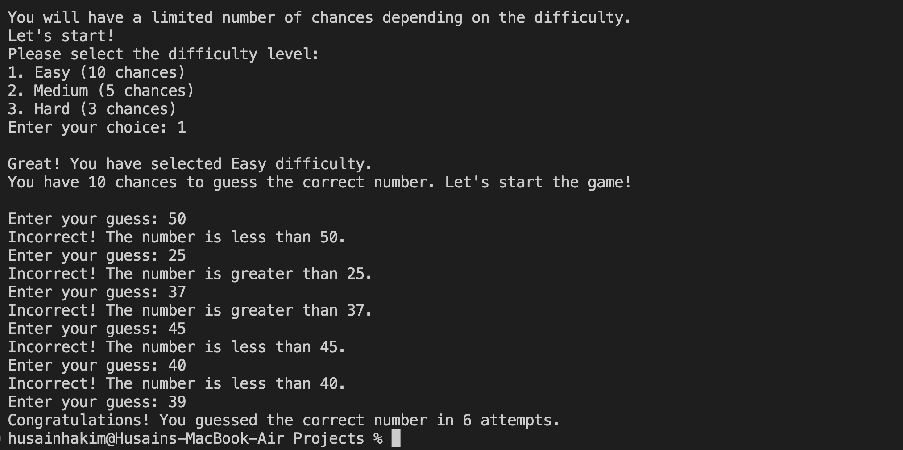
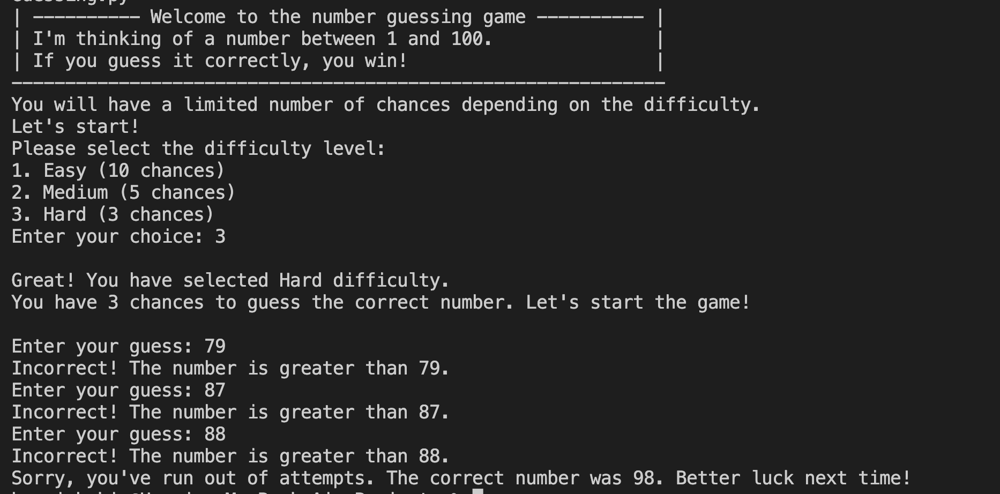

# Number Guessing Game

This Python script is a simple number guessing game where the player attempts to guess a randomly selected number between 1 and 100. The game features different difficulty levels that determine the number of chances available to the player.

## Features

- Randomly selects a number between 1 and 100.
- Three difficulty levels:
  - Easy (10 chances)
  - Medium (5 chances)
  - Hard (3 chances)
- Provides hints on whether the guessed number is too high or too low.

## Prerequisites

- Python 3.x

## Installation

1. **Clone the repository or download the code files.**
   ```bash
   git clone <repository-url>
   ```


2.	**Navigate to the project directory.**
3.	cd number-guessing-game
4.	
# How to Play


1.	Launch the game, and you will be prompted to select a difficulty level (Easy, Medium, or Hard).
2.	After selecting the difficulty, the game will start, and you will have a limited number of chances to guess the correct number.
3.	Enter your guess when prompted, and you will receive feedback if your guess is too high or too low.
4.	If you guess the correct number, the game will congratulate you and display the number of attempts taken.
5.	If you run out of attempts, the game will reveal the correct number.

# Example Output
<h3>Output 1:</h3>


<h3>Output 2:</h3>



# Contact

For any questions or feedback, please contact:

•	Name: Husain Hakim <br>
•	Email: husain.m.hakim.533@gmail.com<br>
•	GitHub: <a href="https://github.com/husainhakim">husainhakim</a>
