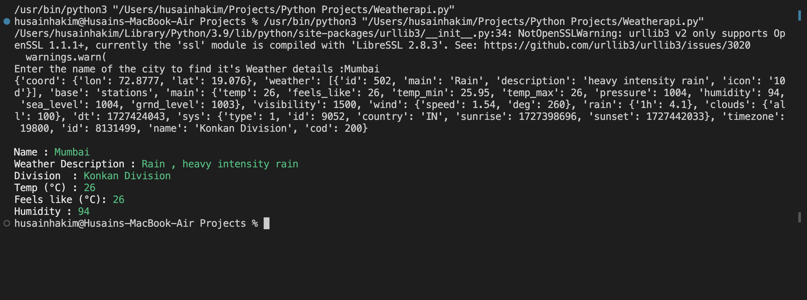
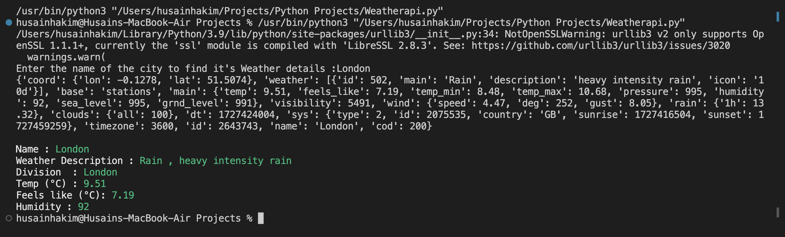

# Weather Info App

This Python script allows users to get real-time weather information for any city in India using the OpenWeatherMap API. The script fetches geographical coordinates (latitude and longitude) of the city and retrieves weather details, including temperature, humidity, and weather description.

# Features:

	•	Fetches latitude and longitude for the entered city.
	•	Provides real-time weather data (temperature, feels-like temperature, humidity, and description).
	•	User-friendly output with color-coded text using colorama.

# Prerequisites:

	•	Python 3.x
	•	requests library
	•	colorama library

# Installation:
<h3> Replace the `api_key` variable in the script with your API key.
 Run the script using:
</h3>

<h3> Enter the name of any city when prompted.</h3>

# Example Output:
<h3>Output 1:</h3>

<h3>Output 2:</h3>

# Error Handling:

•	If the city name is incorrect, the script will prompt you to enter it again.

•	Handles errors gracefully if the city is not found.

# License:

<h4> This project is open source and available under the MIT License.</h4>
