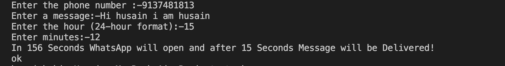

# WhatsApp Message Sender

This Python script allows you to send WhatsApp messages to a specified phone number at a scheduled time using the `pywhatkit` library.

## Features

- Send WhatsApp messages directly from Python.
- Schedule messages using a specific time in 24-hour format.
- Easy-to-use command line interface.

## Prerequisites

- Python 3.x
- `pywhatkit` library

## Installation

1. Clone the repository:
   ```bash
   git clone <repository-url>

2.	Input the following when prompted:
	•	Phone Number: Enter the phone number (without the country code).
	•	Message: Enter the message you want to send.
	•	Hour: Enter the hour (in 24-hour format) for when you want to send the message.
	•	Minutes: Enter the minutes for the scheduled time.

# Example Output:
Output:

Result:

